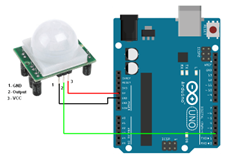
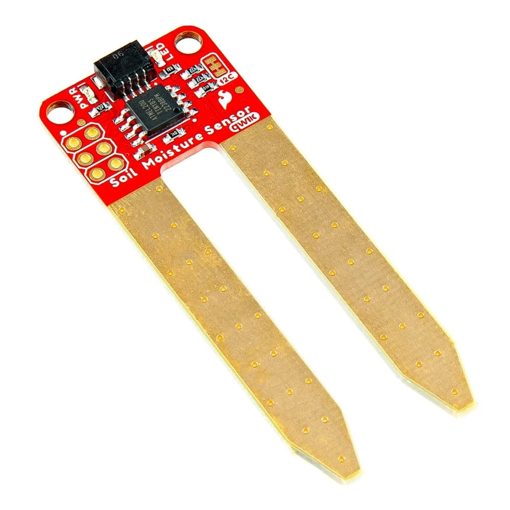
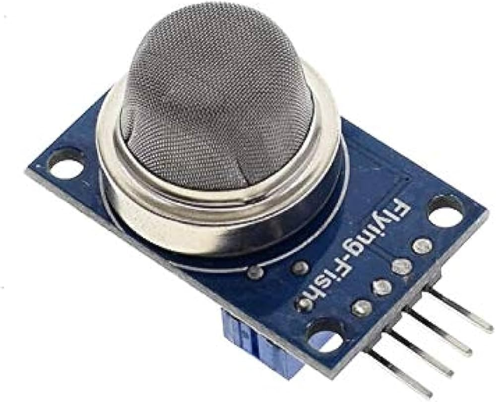

#### Objective

The objective of this experiment is to simulate and understand the interfacing of multiple environmental and motion sensors—**Ultrasonic Sensor, PIR Sensor, DHT Sensor, Soil Moisture Sensor, and MQ135 Gas Sensor**—with an Arduino microcontroller.

This experiment aims to provide in-depth knowledge of **multi-sensor data acquisition**, **environmental parameter monitoring**, and **sensor-based decision making**. It also helps learners understand how different sensors with varied output characteristics (digital, analog, and timing-based) can be integrated into a single embedded system.

#### Introduction

Sensors form the backbone of modern embedded systems and Internet of Things (IoT) applications. A sensor is a device that detects physical, chemical, or environmental changes and converts them into electrical signals that can be processed by a microcontroller.

In real-world systems, a single sensor is often insufficient to describe the surrounding environment accurately. Therefore, multiple sensors are used together to monitor various parameters such as distance, motion, temperature, humidity, soil condition, and air quality. These multi-sensor systems are widely used in applications like **smart agriculture**, **environmental monitoring**, **industrial automation**, **healthcare systems**, and **smart cities**.

In this experiment, Arduino acts as a central processing unit that collects data from multiple sensors, processes the sensor readings, and enables intelligent decision making. This simulation demonstrates how different sensors operate simultaneously and how Arduino handles multiple inputs efficiently.

#### Arduino Sensor Interfacing Theory

Arduino supports multiple sensor interfacing techniques depending on sensor type and output signal characteristics. Sensors connected to Arduino can be broadly classified into:

- **Digital Sensors** – Provide discrete output (HIGH or LOW)
- **Analog Sensors** – Provide continuous voltage output
- **Timing-Based Sensors** – Depend on pulse duration or communication timing

Arduino contains an internal **Analog-to-Digital Converter (ADC)** that converts analog voltages in the range of **0–5V** into digital values between **0 and 1023**. This conversion allows Arduino to process real-world analog signals digitally.

To handle sensor data efficiently, Arduino provides built-in functions and supports external libraries that simplify sensor interfacing and ensure accurate readings.

**Commonly used Arduino functions include:**
- `digitalRead()` – Reads binary output from digital sensors  
- `analogRead()` – Reads analog voltage levels from sensors  
- `pulseIn()` – Measures pulse duration for timing-based sensors  
- Sensor-specific libraries – Used for calibration and protocol handling  

#### Components
#### 1. Ultrasonic Sensor

##### Working Principle

An ultrasonic sensor measures distance using **high-frequency sound waves** beyond the range of human hearing. The sensor emits an ultrasonic pulse through its **Trigger** pin. When this pulse strikes an object, it is reflected back and received by the **Echo** pin.

The time taken by the pulse to travel to the object and return is measured. Distance is calculated using the **time of flight** principle:

Distance = (Speed of Sound × Time) / 2

This method provides accurate distance measurement without physical contact.

##### Interfacing with Arduino

- Trigger pin connected to a **digital output pin**
- Echo pin connected to a **digital input pin**
- `pulseIn()` function used to measure echo time

*Source: HC-SR04 Datasheet*

##### Applications

- Obstacle detection in robotics  
- Distance measurement systems  
- Smart parking and vehicle detection  

#### 2. PIR Sensor

##### Working Principle

A PIR (Passive Infrared) sensor detects motion by sensing changes in infrared radiation emitted by warm objects such as humans or animals. The sensor contains pyroelectric elements that respond to variations in infrared energy.

When motion is detected within the sensing range, the PIR sensor outputs a **HIGH signal**. In the absence of motion, the output remains **LOW**. Sensitivity and delay time can be adjusted using onboard potentiometers.

##### Interfacing with Arduino

- Output pin connected to a **digital input pin**
- No continuous power signal required from Arduino

<!-- 

  -->

  
*Source: PIR Sensor Datasheet*

##### Applications

- Motion-based security systems  
- Automatic lighting control  
- Occupancy detection systems  

#### 3. Soil Moisture Sensor

##### Working Principle

A soil moisture sensor determines the water content in soil by measuring its electrical conductivity. Wet soil conducts electricity more efficiently than dry soil, resulting in different resistance values.

These resistance changes are converted into voltage variations, which are read by Arduino as analog values. This enables continuous monitoring of soil moisture levels.

##### Interfacing with Arduino

- Analog output connected to an **analog input pin**
- Moisture level interpreted using ADC values

*Source: Agricultural Sensor Documentation*

##### Applications

- Automated irrigation systems  
- Precision farming  
- Crop health monitoring  

#### 4. MQ135 Gas Sensor

##### Working Principle

The MQ135 gas sensor is designed to detect air quality and harmful gases such as ammonia, carbon dioxide, benzene, and smoke. The sensing element changes its resistance in the presence of gases, resulting in varying output voltage.

The sensor requires a **preheating period** to stabilize before accurate measurements can be obtained.

##### Interfacing with Arduino

- Analog output connected to an **analog input pin**
- Requires calibration for accurate gas concentration measurement

*Source: MQ135 Sensor Datasheet*

##### Applications

- Air quality monitoring  
- Pollution detection systems  
- Industrial safety applications  

#### Conclusion

This experiment provides a comprehensive understanding of interfacing multiple sensors with Arduino for real-time environmental monitoring. The knowledge gained from this experiment forms a strong foundation for designing advanced embedded systems and IoT solutions such as smart agriculture platforms, environmental monitoring systems, and intelligent automation.

#### References

1. Arduino Official Documentation – https://www.arduino.cc  
2. HC-SR04 Ultrasonic Sensor Datasheet  
3. PIR Motion Sensor Datasheet  
4. Adafruit DHT Sensor Guide  
5. MQ135 Gas Sensor Datasheet  
6. Embedded Systems Design – Raj Kamal  

